---
title:硬件开坑
---

[toc]

# 零——写在开坑之前

一直对硬件这些小东西很感兴趣，想着自己动手做一个遥控车；但是真正下定决心动手还是源于一个多月后的七夕，想为心爱的女孩子做一些有心意的东西，同时具有浓郁的个人风格。

本次灵感来源于网上有人用键帽字符组成别有新意的情话做成一个小相框

如下图：

**目标：**

- 完整表白键盘按键
- 键帽透光
- 可根据按键顺序，led灯珠显示不同的色彩图案
- 可利用键盘设定电子密码

# 壹——准备材料

- 电烙铁
- 焊锡丝 * 2
- 切割垫
- 洞洞板 * 3（两个练手一个成品）
- 面包板
- 铜柱 * 10
- 青稞纸背胶（买完洞洞板发现这玩意可能导致密恐，到时候贴上盖住点儿，绝缘贴纸）
- 导线 （20AWG ,10 m）
- 斜嘴钳（剪断导线用）
- 9 v 电池*2 + 电池盒
- 8寸相框
- 热熔枪
- AT89C51-24PI 芯片 *5
- L7805 三端稳压管（输出5v 1.5A电流供电）*4
- USB 转TTL接口 *5
- 1N4148电阻 *50
- 红色、黑色透光键帽
- 马里奥键帽
- 键轴（紫轴）*20
- 方形led灯珠 *90
- 螺丝刀（在洞洞板上挖洞）
- 4-16译码器

# 贰——理论支撑

## 单片机简单原理

### 1.术语

**波特率**，数据信号对载波的调制速率，它用单位时间内载波调制状态改变的次数来表示；在信息传输通道中，携带数据信		息的信号单元叫码元，每秒钟通过信道传输的码元数称为码元传输速率，简称波特率。波特率是传输通道频宽的指标

>https://blog.csdn.net/qq_40147893/article/details/106539081

校验位：奇偶校验（补一位，满足1个数为奇数个或者偶数个）

**PC**，程序计数器

**三极管**，https://www.sohu.com/a/271229009_100149984，三极管8550的管脚图：

1脚=E（发射极，带箭头的那个），

2脚=B（基极），

3脚=C（集电极）.

8550三极管（SOT-23封装）管脚图

1、B（基极）　2、E（发射极)　3、C（集电极)。

对于NPN管，它是由2块N型半导体中间夹着一块P型半导体所组成，发射区与基区之间形成的PN结称为发射结,而集电区与基区形成的PN结称为集电结,三条引线分别称为发射极e （Emitter）、基极b (Base)和集电极c (Collector)。

**阳极为anode，阴极为cathode**： RGBLED-CA    RGBLED-CC

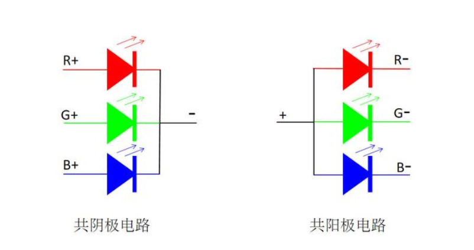

译码器高/低电平有效（74HC/LS/HCT/F系列芯片的区别）：https://zhidao.baidu.com/question/1757952048280138108.html

晶振，符号是CRYSTAL

电阻，符号是RESISTOR

电容，符号是CAPACITOR

### 2.复位电路与时钟电路

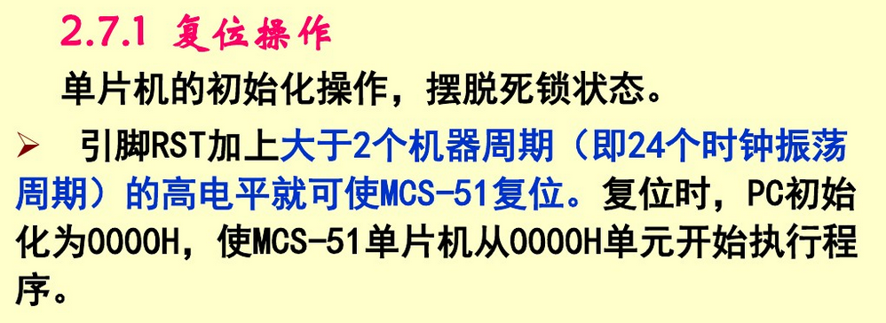

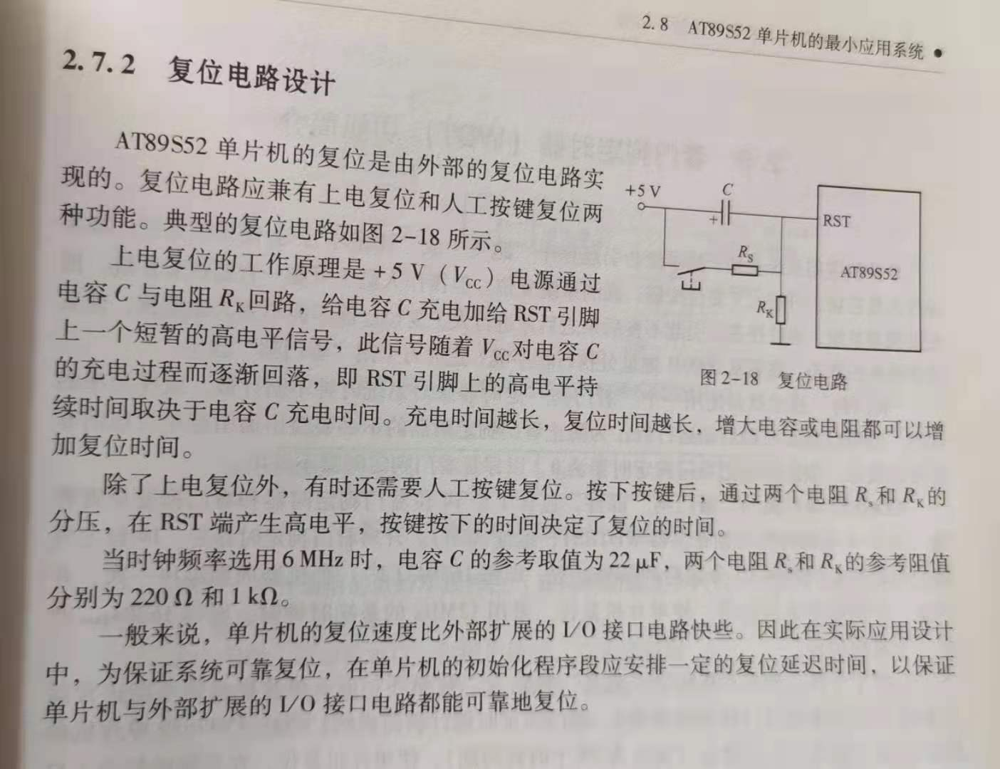

打算采用上电复位方式，因为机械键轴的扰动，去除按键复位。

时钟电路：

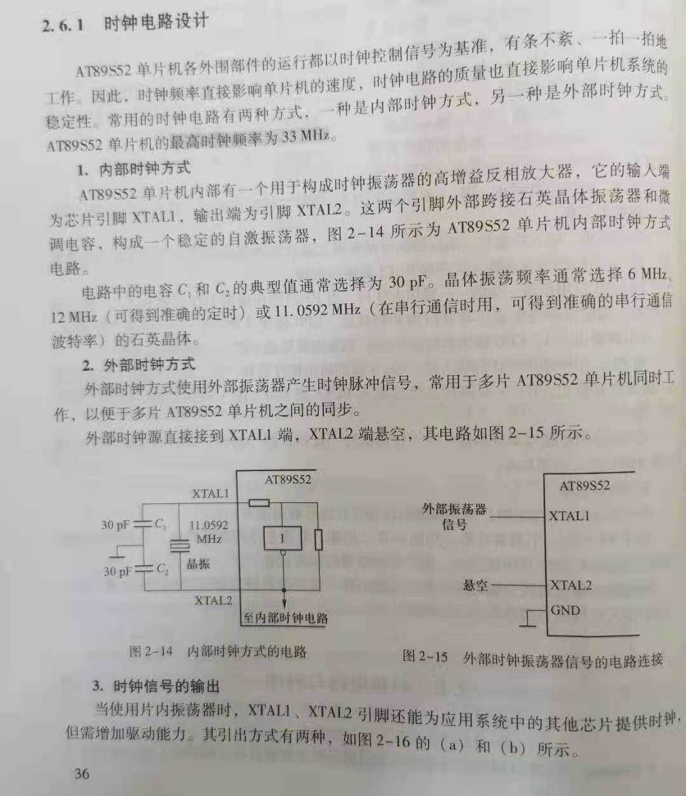

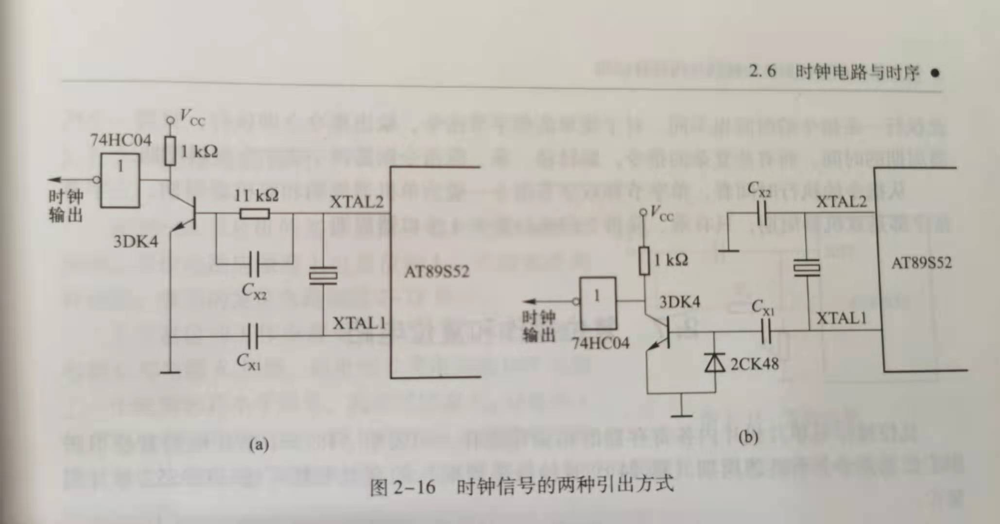

 

### 3.单片机中断系统

封装好的MCU内部，CPU 通过四个8位寄存器及驱动电路，控制相对应的I/O引脚，在TTL电平规范中，高电平1代表5v，低电平0代码0v，表示为P0-P3

XTAL1/2为晶振接口

VCC接电源正极，GND接电源负极，

RST芯片复位接口

**中断允许寄存器IE**

中断源包括 2个定时/计数器中断（T0、T1、T2），2个外部中断（EX0、EX1），一个串口中断（ES）

中断优先级：EX0 > ET0 > EX1 > ET1 > ES 

**中断优先级寄存器IP**

**定时/ 计数器 控制寄存器 TCON**

高四位用于定时器功能，第四位用于外部中断功能

**定时器模式控制寄存器 TMOD**

高四位用于定时器1控制，低四位用于定时器0控制，不可位寻址操作。

**功能寄存器 TH0 TL0**

8051单片机的两个定时器T0和T1分别都由两个特殊功能寄存器组成；

T0由特殊功能寄存器TH0和TL0构成，而T1则是由TH1和TL1构成; 

作为**定时器**使用时，振荡器输出经过12分频后的脉冲个数，即：每个机器周期使定时器T0/T1的寄存器值自动累加1，直到溢出,溢出后继续从0开始循环计数，而每个机器周期为12个时钟震荡周期，因此定时器的分辨率是时钟振荡频率的1/12; 

作为**计数器**使用时，通过引脚T0(P3.4)或T1(P3.5)对外部脉冲信号进行计数，当输入的外部脉冲信号发生从1到0的负跳变时，计数器的值就自动加1；计数器的最高频率一般是时钟振荡频率的1/24

### 4.串口与通讯

UART
$$
I^2C
$$
SPI

1-Wire

全双工

半双工

单工

## 键盘电路

使用矩阵键盘减少 I/O 口占用，但传统的矩阵键盘无法处理组合按键（即同时按住多个键位，以进行灯泡闪亮的模式切换）

网上大神给出的电路图，红色高电平，蓝色低电平，其中二极管接反了

### 1.键盘任务

- 判断是否有按键按下（去抖动）
- 识别键盘按键号
  - 编码键盘（专用接口芯片 HD7279）
  - 非编码键盘（与单片机I/O 口相连）
    - 独立式键盘
    - 矩阵式键盘
- 根据按键找到对应处理程序入口

### 2.去抖

软件去抖：

执行延时 10ms 子程序判断电平是否不变

硬件去抖：

（略）

### 3.键盘设计

 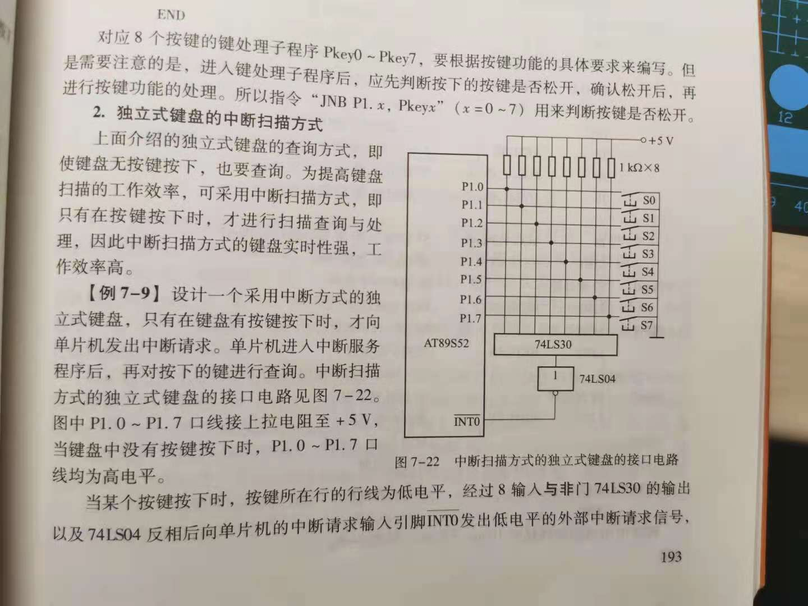

## LED电路

### 1.任务：

- 键帽在按下时，内置RGB小灯发光，可按照两三种闪亮模式缓慢闪动
- 摆出心型LED灯珠序列，依次点亮，组成不同的闪亮方式
- 心型内部闪亮出 一木 的汉字
- 灯摆出两个人的卡通形状（看难度）
- 内部显示红玫瑰图案
- 使用单色led灯，外部红色，pwm控制亮度，内部黄色

闪亮模式参考B站 [swiyix](https://space.bilibili.com/304563534) 心型流水灯视频代码

更改需求：摆出一个心型LED灯组合，内部使用LED电路板印刷出两人合照，黑色底版

使用贴片RGB灯，ws2812b,3528封装与3535封装引脚完全一致

炸了，ws2812b 芯片时序要求高，51芯片时钟频率无法满足，强行满足需要汇编C语言混合编程，时间来不及了啊。。。

改需求预算，换成粉色单色等，键帽改成自动慢闪灯。。。。。。

### 2. 16*16点阵显示屏

显示原理：

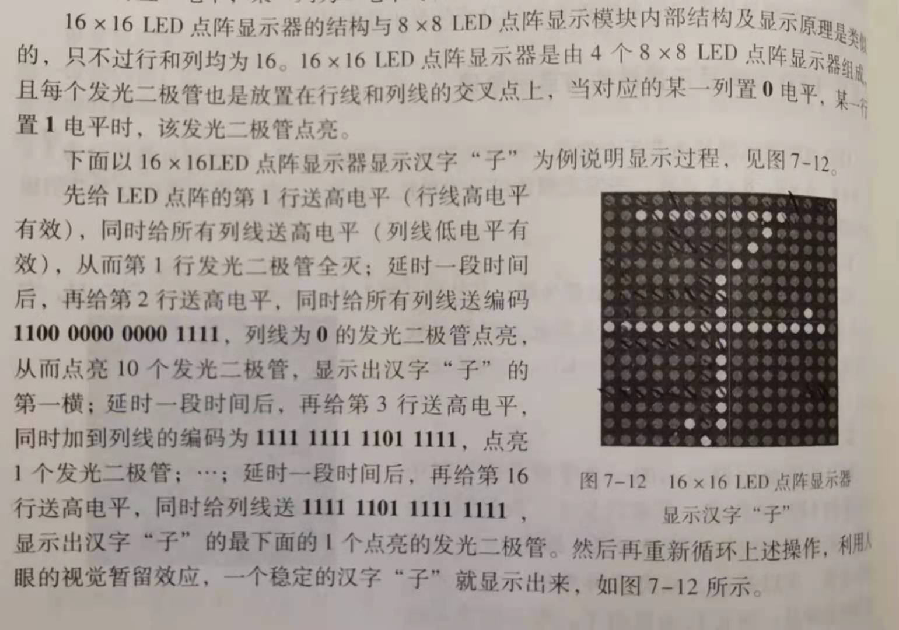

即每一行依次点亮，利用人眼暂留实现稳定显示

使用4-16线译码器实现逐行扫描减少 I/O 口占用，原理如下

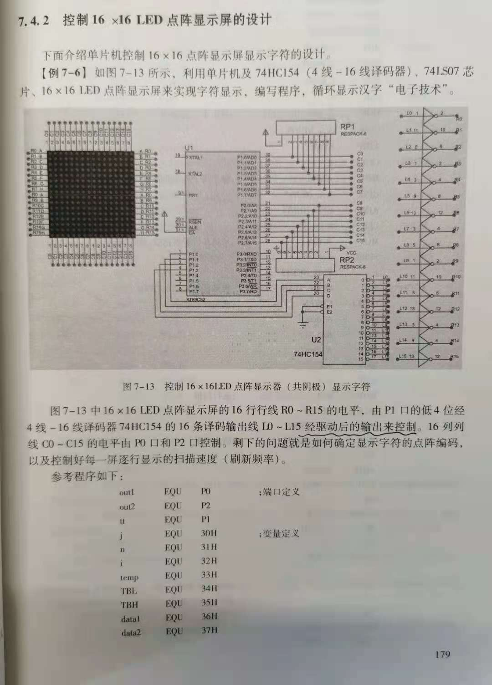

### 3.键帽 RGB 闪亮电路设计

共19个led灯，但由于有rgb三个引脚，共阳极

采用4-16译码器，由于键帽不透光，省去3个RGB灯，因此得到`(16*3)*1`结构，即16行3列

每个时刻，由于译码器输出，只有一行为高电平，接LED灯的共阳极;

每一列分别连接单片机的一个 I/O 脚，低电平导通

不使用三极管放大电流

键帽LED灯共占用引脚数：4+3 = 7

由于共阳极，RGB三个引脚需要开关二极管保护

1N4148N引脚图：

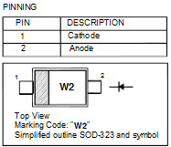

验证1N4148N击穿电压满足保护led灯条件：

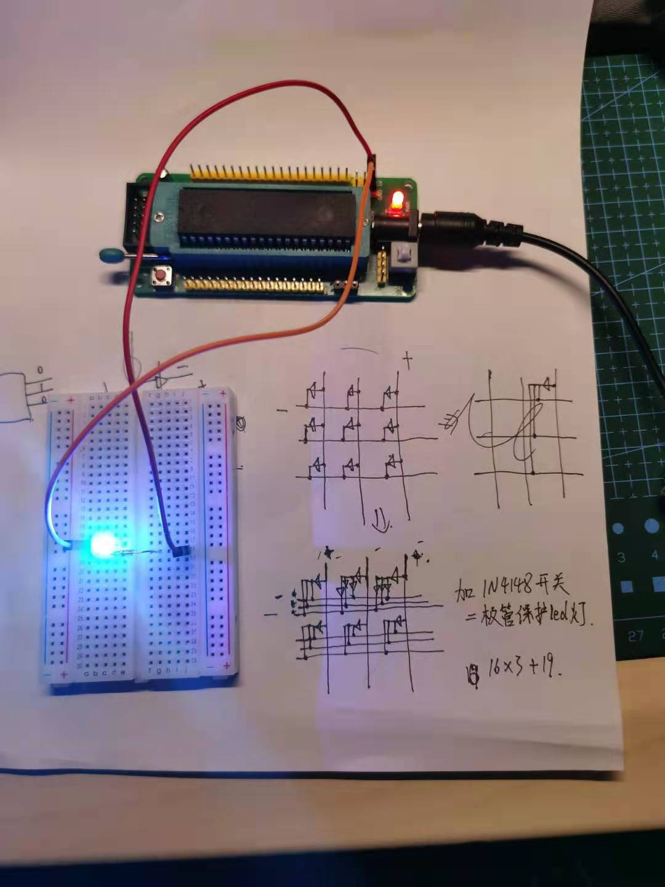

因此需要开关二极管 16*3 + 19 = 67 个，需要加购。。

（经验证，不接开关二极管确实会击穿led）

### 4.心型粉色LED灯

粉色两个引脚，连接4-16译码器，`(16*1)*4` ,控制64个led灯

心型LED灯共占用引脚数：4+4 = 8

## EDA仿真

### 1.Multisim软件

使用进行仿真入门学习，软件使用相关教程见参考资料

具体步骤：

1.建立电路文件

2.放置元器件和仪表

3.元器件编辑

4.连线和进一步调整

5.电路仿真

6.输出结果

[C51芯片仿真](https://blog.csdn.net/yf210yf/article/details/70230508)

[调整工作区尺寸](https://www.xiazaiba.com/jiaocheng/51053.html)

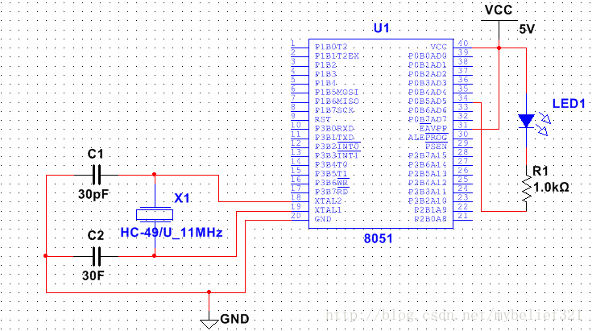

放置导线：ctrl + Q

**一些元器件名称：**

晶振，符号是CRYSTAL

电阻，符号是RESISTOR

电容，符号是CAPACITOR

>指在给定电位差下自由电荷的储藏量，记为C，国际单位是法拉（F）
>
>1法拉（F）= 10^3毫法（mF）=10^6微法（μF）=10^9纳法（nF）=10^12皮法（pF）=10^15fF

### 2.proteus 仿真

>总线：
>
>

如何在proteus 中无线连接两个器件 https://jingyan.baidu.com/article/dca1fa6f4f6361f1a44052e7.html

代码使用 Keil 软件编译，

简单使用方法：https://www.jianshu.com/p/88dfc09e7403

### 3.立创EDA

https://lceda.cn/page/download?src=index

要想打板，需要先进行电路仿真，仿真没问题之后再在立创EDA上面画一遍，进行打板

## PCB设计

太难了。。。

### 1.PCB的设计流程

- 使用人数较多的PCB的EDA工具有三款，Altium Designer、Mentor PADS和Cadence（包含OrCAD和Allegro），EAGLE、Protel、立创EDA等。

  对于初学者，推荐使用Altium Designer，对于可能成为专业人士的人，推荐使用Cadence

- 确定电路原理图。

- 绘制封装

- 创建工程、创建页面、摆放器件

- 连接器件

- 导出/导入网表（netlist）

  对于PADS和Cadence而言，原理图绘制和PCB绘制使用的是不同的软件，因此需要从原理图软件中导出所有元器件的引脚及其连接关系，再将其导入PCB软件，中间生成的文件，一般称其为网络表格（netlist），但对于Altium Designer而言，其原理图设计软件和PCB设计软件统一在同一个界面内了，因此只需要一个按键即可完成PCB的网表导入，并不需要先导出再导入。

  原理图的设计和PCB的设计并不是必须使用同一套软件，netlist的表示方法和标准，也是很多软件共享的，可以实现很多不同原理图软件和PCB软件之间相互的导出导入。

- 绘制PCB封装

  PCB封装就是一个器件在PCB上的焊盘、丝印、占据空间等元素组成的合集，直观的说，就跟下面的图片一样。

- 设置PCB板的基础参数

  PCB板的基础参数设置包括板厚、层数和层间距，虽然这3项是最基础的设计，但除了层数，另外两项并不能自然的被表示在设计输出文档中，因此一般都是直接用文字告知PCB生产厂家。 

  除了层数，叠层设计也是很重要的，哪些层走线、哪些层铺平面、哪些层混合平面和走线。

  单层板不需要这个设置，双层板一般双面走线，空余的地方敷铜并设置为GND或VCC，多层板的话则会有所要求的，4层板一般2和3层设置为GND和VCC，表层和底层走线，VCC层也可以适当走线，6层板的话，如果对地平面要求高一些，则将2/5层设为GND，3或4层设置为VCC，其它层都用来走线。

- 绘制外框

- 放置器件

- 设置过孔、线宽、线距等常用参数和规则

- 设置高级规则

- 布线和绘制块状网络（shape）

- 调整丝印

- 导出钻孔文件（drill）和光绘文件（gerber）

- 指定PCB的加工技术参数和工艺要求

### 2.一些概念

[PCB封装](http://www.elecfans.com/article/89/92/2019/20190424920859.html)：就是元器件往PCB板上焊接时在板上的焊盘尺寸

PCB封装尺寸：0402-0603-0805 https://blog.csdn.net/li707414287/article/details/99239656

焊盘：表面贴装装配的基本构成单元，用来构成电路板的焊盘图案(land pattern)，即各种为特殊元件类型设计的焊盘组合。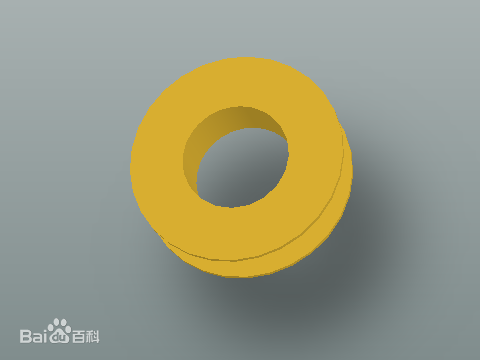

接插件：也叫连接器。国内也称作接头和插座，一般是指电器接插件。即连接两个有源器件的器件，传输电流或信号。

公端与母端经由接触后能够传递讯息或电流，也称之为连接器

## 参考资料

【1】如何从零开始做一把机械键盘？ - 发光二极管的回答 - 知乎 https://www.zhihu.com/question/55254589/answer/144498957

【2】Multisim仿真入门教程（以最简单的二极管电路为例） - 江汉望星的文章 - 知乎 https://zhuanlan.zhihu.com/p/266543201

【3】https://www.jb51.net/softs/569183.html#downintro2

【4】https://www.bilibili.com/video/BV1Xx411X7Gy?from=search&seid=13133510381331668511

# 叁——爱的号码牌

本部分主要解释礼物自身内涵，简要介绍设计思路以及一个简单的操作指南

## 字母解析

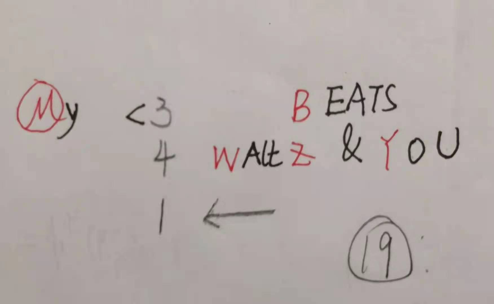

红色M键：复位键（选自机械键盘键帽中最具代表性的一个马里奥键位）

<3：横着看是一个心型，表示自己的心脏

B：红色按键，与下面的 Z 构成我名字首字母的缩写

4：four 谐音 for 

Waltz：华尔兹，一般西方婚礼上会跳华尔兹，爱的华尔兹，取其浪漫美好的意味

&：‘与’ 操作，表示 and ，在这里作为一个连接词

WZY：宝贝的名字首字母缩写

<—：表示要开始反方向看，return

143：谐音古代英语中i fall thee（古英语thou的宾格，类似于中文的汝）(143).是我爱你的意思

所有键帽加一起一共19个，暗含宝贝今年19岁

## 效果展示

预计成品形状：

上电启动阶段，依次

1) 闪亮后熄灭（呼吸灯方式）： My  

2) <3 闪亮（呼吸灯）后保持亮度， 同时亮起心型图案，<3熄灭
3) 逐个闪亮BEATS每个字母，同时心型一闪一闪呼应 ，显示心脏跳跃的感觉
4) 字母4 闪亮
5) 同时闪亮Waltz 为一个颜色，此时心型LED出现婚礼华尔兹流水灯效果
6) 闪亮&
7) 闪亮YOU， 此时心型LED保存粉红色常亮
8) YOU 熄灭后，闪亮  W Z Y
9) 闪亮 <——
10) 依次闪亮1 4 3
11) 依次闪亮 Z B
12) 启动阶段结束，开启键帽自动播放模式1

## 按键指令

ALT键控制键帽led发光方式：

- alt + 
- 

M 键控制心型灯发光方式：

- M + y 自动放映
- M + 
- M + 
- M + 
- M + 
- M + 
- M + 
- M + 
- M + 

<— 键控制心型灯亮度，共三档：

- <— + 4  提高亮度

- <— + 1 减小亮度

# 肆——附录：阶段进展

### Date 07-14

纠结了好久如何将键轴安装到洞洞板上，后来知乎发现大佬们都是手挖孔的，要么就自己设计PCB板。。。

手艺人 Respect

测试可行性，在洞洞板上挖孔安放键轴

装上测试才发现灯珠买大了，不能是圆形的，重新下单方形灯珠

### Date 07-15

川哥女装，激动好半天

下载安装multisim 14.2中文破解版

下载完成，明天研究电路模拟仿真，如何点亮灯泡

### Date 07-16

更正灯珠大小没问题，是我装错了，感谢单哥指点

新问题是这个灯珠是RGB三个色随机闪动，需要重新购买材料（四引脚扁的方形灯珠），重新加购了开发板以及杜邦线母对公用于程序烧录

对于洞洞板，19个键帽好像飞线会非常复杂，同学建议PCB打板，打算先学一下电路图，看淘宝能不能打出来15*20的板子吧

### Date 07-20

重新订购的RGB彩灯和开发板到啦~

### Date 07-27

加购1N4148电阻 ，用以矩阵键盘组合键控制

### Date 07-28

C51中断仿真练手

### Date 07-30

借单片机书，学习Proteus 流水灯仿真

### Date 08-01

键盘电路及单片机原理学习

### Date 08-02

LED 电路原理学习，4-16线译码器、芯片底座购买

### Date 08-04

立创EDA学习  

### Date 08-07

灯泡重新选购，因为4-16线译码器输出低电平有效，需要灯泡共阴极，阴极与译码器相连

### Date 08-08

因为仿真软件各种bug,放弃仿真，直接在电路板上测试

### Date 08-09

最新计划，使用两个c51芯片，串口通信，一块负责键盘及其灯光，一块负责心型lEd灯，使用64个RGB灯

其中，使用74HC238输出高电平有效，74HC138输出低电平有效

**键帽部分LED引脚数：**

3 + (2 or 3)*3 = 9 or 12

由于键帽部分使用共阳极RGB二极管，因此使用高电平有效74HC238译码器连接阳极

**键帽按键部分引脚数：**

4 + 5 = 9

**心型灯（64led）部分引脚数：**

3 + 8*3 = 27

使用共阴极RGB二极管，使用74HC138译码器，连接阴极；

### Date 08-10

再次更改计划，

用八寸洞洞板模拟效果，还是太挤且可能导致密恐，计划LED打板，外加定制亚克力作为定位板，同时制作封装外壳，外接电源

心型LED灯看位置

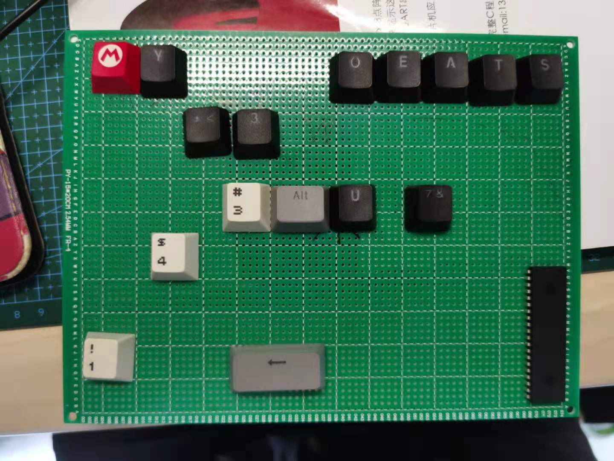

啊，直接做一个键盘然后外加LED心型灯光控制
