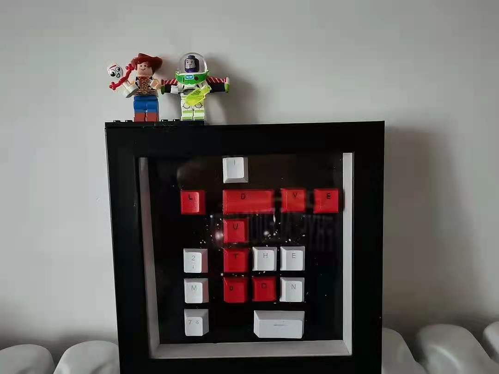
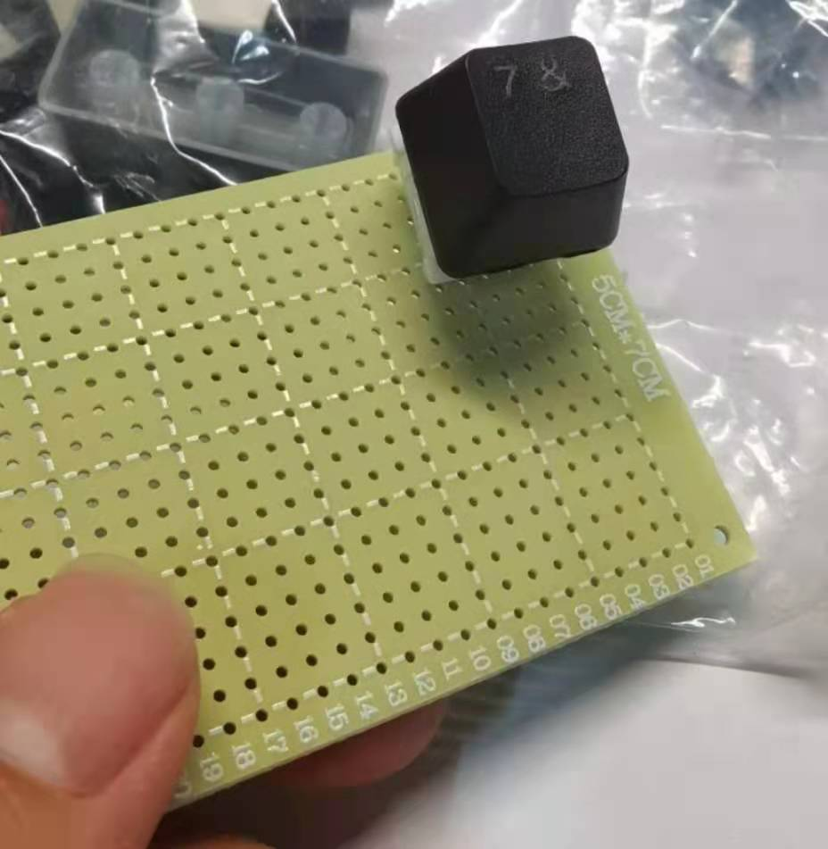

---
title:硬件开坑
---

[toc]

# 写在开坑之前

一直对硬件这些小东西很感兴趣，想着自己动手做一个遥控车；但是真正下定决心动手还是源于一个多月后的七夕，想为心爱的女孩子做一些有心意的东西，同时具有浓郁的个人风格。

本次灵感来源于网上有人用键帽字符组成别有新意的情话做成一个小相框

如下图：

**目标：**

- 完整表白键盘按键
- 键帽透光
- 可根据按键顺序，led灯珠显示不同的色彩图案
- 可利用键盘设定电子密码

# 准备材料

- 电烙铁
- 焊锡丝 * 2
- 切割垫
- 洞洞板 * 3（两个练手一个成品）
- 面包板
- 铜柱 * 10
- 青稞纸背胶（买完洞洞板发现这玩意可能导致密恐，到时候贴上盖住点儿，绝缘贴纸）
- 导线 （20AWG ,10 m）
- 斜嘴钳（剪断导线用）
- 9 v 电池*2 + 电池盒
- 8寸相框
- 热熔枪
- AT89C51-24PI 芯片 *5
- L7805 三端稳压管（输出5v 1.5A电流供电）*4
- USB 转TTL接口 *5
- 1N4148电阻 *50
- 红色、黑色透光键帽
- 马里奥键帽
- 键轴（紫轴）*20
- 方形led灯珠 *90
- 螺丝刀（在洞洞板上挖洞）

# 理论支撑

## 单片机中断系统

封装好的MCU内部，CPU 通过四个8位寄存器及驱动电路，控制相对应的I/O引脚，在TTL电平规范中，高电平1代表5v，低电平0代码0v，表示为P0-P3

XTAL1/2为晶振接口

VCC接电源正极，GND接电源负极，

RST芯片复位接口

**串口通信协议：**

UART
$$
I^2C
$$
SPI

1-Wire

全双工

半双工

单工

**波特率**，数据信号对载波的调制速率，它用单位时间内载波调制状态改变的次数来表示；在信息传输通道中，携带数据信		息的信号单元叫码元，每秒钟通过信道传输的码元数称为码元传输速率，简称波特率。波特率是传输通道频宽的指标

>https://blog.csdn.net/qq_40147893/article/details/106539081

校验位：奇偶校验（补一位，满足1个数为奇数个或者偶数个）

**中断允许寄存器IE**

中断源包括 2个定时/计数器中断（T0、T1、T2），2个外部中断（EX0、EX1），一个串口中断（ES）

中断优先级：EX0 > ET0 > EX1 > ET1 > ES 

**中断优先级寄存器IP**

**定时/ 计数器 控制寄存器 TCON**

高四位用于定时器功能，第四位用于外部中断功能

**定时器模式控制寄存器 TMOD**

高四位用于定时器1控制，低四位用于定时器0控制，不可位寻址操作。

**功能寄存器 TH0 TL0**

8051单片机的两个定时器T0和T1分别都由两个特殊功能寄存器组成；

T0由特殊功能寄存器TH0和TL0构成，而T1则是由TH1和TL1构成; 

作为**定时器**使用时，振荡器输出经过12分频后的脉冲个数，即：每个机器周期使定时器T0/T1的寄存器值自动累加1，直到溢出,溢出后继续从0开始循环计数，而每个机器周期为12个时钟震荡周期，因此定时器的分辨率是时钟振荡频率的1/12; 

作为**计数器**使用时，通过引脚T0(P3.4)或T1(P3.5)对外部脉冲信号进行计数，当输入的外部脉冲信号发生从1到0的负跳变时，计数器的值就自动加1；计数器的最高频率一般是时钟振荡频率的1/24

## EDA仿真

使用Multisim软件进行仿真入门学习，软件使用相关教程见参考资料

具体步骤：

1.建立电路文件

2.放置元器件和仪表

3.元器件编辑

4.连线和进一步调整

5.电路仿真

6.输出结果

[C51芯片仿真](https://blog.csdn.net/yf210yf/article/details/70230508)

[调整工作区尺寸](https://www.xiazaiba.com/jiaocheng/51053.html)

**一些元器件名称：**

晶振，符号是CRYSTAL

电阻，符号是RESISTOR

电容，符号是CAPACITOR

>指在给定电位差下自由电荷的储藏量，记为C，国际单位是法拉（F）
>
>1法拉（F）= 10^3毫法（mF）=10^6微法（μF）=10^9纳法（nF）=10^12皮法（pF）=10^15fF

2.proteus 仿真

>总线：
>
>

3.打板使用立创EDA

https://lceda.cn/page/download?src=index

## 矩阵键盘电路

其中二极管接反了

## 键帽组成的含义

143：谐音古代英语中i fall thee（古英语thou的宾格，类似于中文的汝）(143).是我爱你的意思。

## 参考资料

【1】如何从零开始做一把机械键盘？ - 发光二极管的回答 - 知乎 https://www.zhihu.com/question/55254589/answer/144498957

【2】Multisim仿真入门教程（以最简单的二极管电路为例） - 江汉望星的文章 - 知乎 https://zhuanlan.zhihu.com/p/266543201

【3】https://www.jb51.net/softs/569183.html#downintro2

# 阶段进展

## 日期

### Date 07-14

纠结了好久如何将键轴安装到洞洞板上，后来知乎发现大佬们都是手挖孔的，要么就自己设计PCB板。。。

手艺人 Respect

测试可行性，在洞洞板上挖孔安放键轴

装上测试才发现灯珠买大了，不能是圆形的，重新下单方形灯珠

### Date 07-15

川哥女装，激动好半天

下载安装multisim 14.2中文破解版

下载完成，明天研究电路模拟仿真，如何点亮灯泡

### Date 07-16

更正灯珠大小没问题，是我装错了，感谢单哥指点

新问题是这个灯珠是RGB三个色随机闪动，需要重新购买材料（四引脚扁的方形灯珠），重新加购了开发板以及杜邦线母对公用于程序烧录

对于洞洞板，19个键帽好像飞线会非常复杂，同学建议PCB打板，打算先学一下电路图，看淘宝能不能打出来15*20的板子吧

### Date 07-20

重新订购的RGB彩灯和开发板到啦~

### Date 07-27

加购1N4148电阻 ，用以矩阵键盘组合键控制

### Date 07-28

C51中断仿真练手

### Date 07-30

借单片机书，学习Proteus 流水灯仿真

